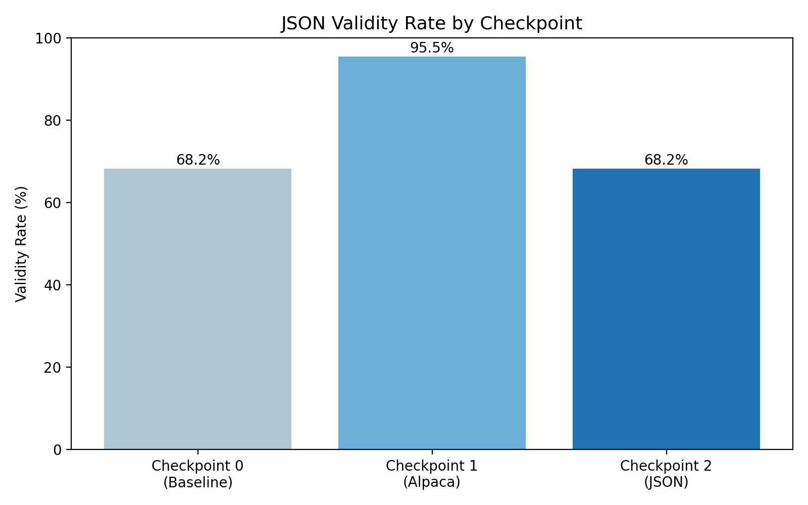
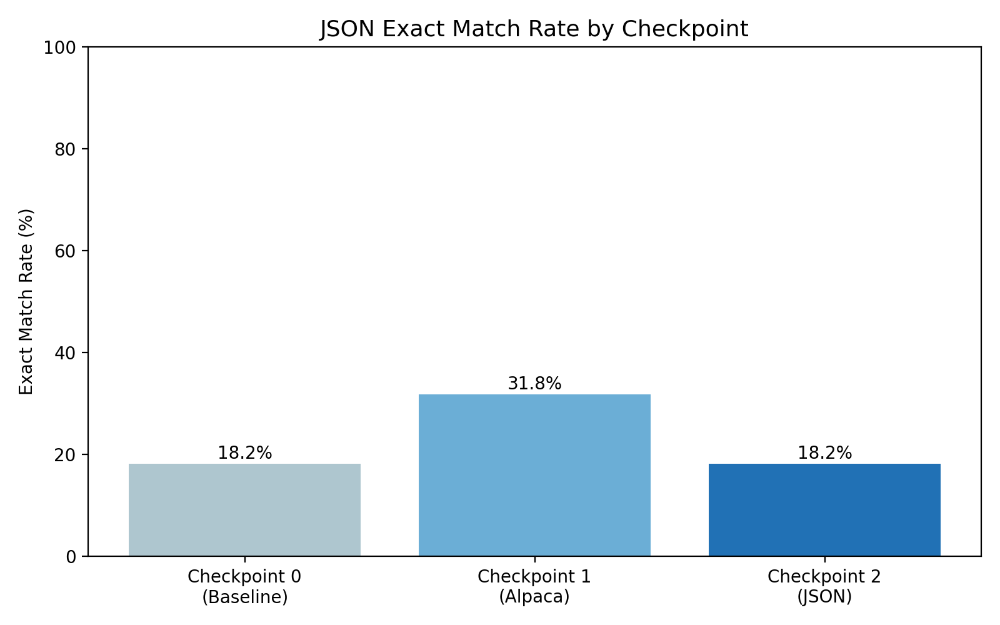
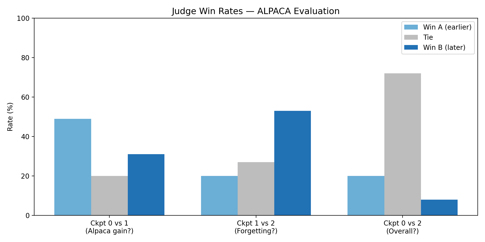
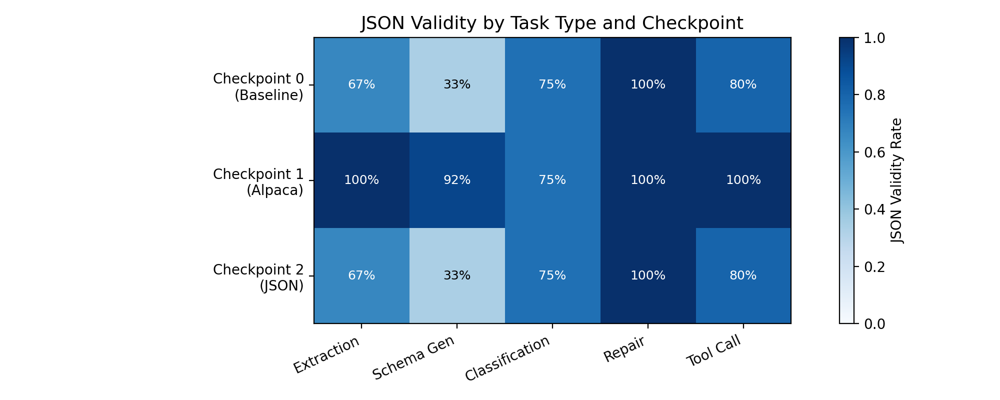
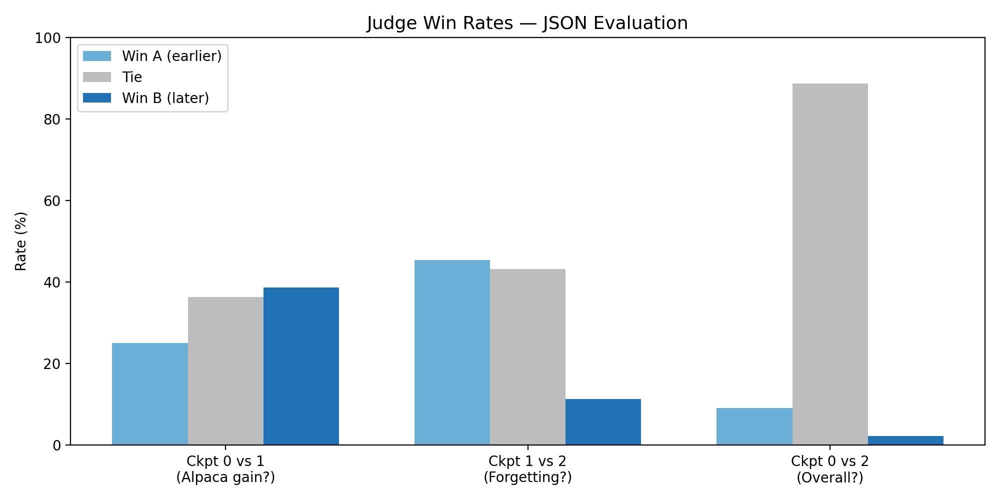

# Sequential Instruction Tuning of a Small LLM with Strong-Model Judge Evaluation

## Executive Summary

This assignment implements a two-stage instruction-tuning pipeline for Phi-3.5 Mini (3.8B parameters) to investigate catastrophic forgetting during sequential fine-tuning. Stage 1 fine-tunes on 10,000 Alpaca general instruction examples. Stage 2 continues fine-tuning on 396 teacher-generated JSON structured examples via imitation learning from Llama 3.3 70B Instruct (UTSA API).

Key Results:

- Checkpoint 1 (Stage 1) achieves 95.5% JSON validity on structured output tasks, improving over the 68.2% baseline
- Stage 2 causes severe catastrophic forgetting: JSON validity drops from 95.5% back to 68.2%
- The judge evaluation confirms Checkpoint 1 beats Checkpoint 2 on JSON tasks 45.5% vs 11.4%
- Stage 2 paradoxically improved general Alpaca task performance (53% win rate vs Checkpoint 1)

Conclusion: Stage 1 Alpaca training unexpectedly produced the best structured output performance. Stage 2 JSON training with a small dataset (396 examples) caused catastrophic forgetting, reverting all JSON gains. The complete pipeline is reproducible on UTSA HPC Arc with all code provided in the repository.

---

## 1. Methodology

### 1.1 Student Model Selection

**Selected Model:** microsoft/Phi-3.5-mini-instruct (3.8B parameters)

**Justification:** Phi-3.5 Mini was selected over alternatives (Llama 3.2 3B, Qwen2.5 3B, Gemma 2 2B) because its instruction-following optimization and QLoRA compatibility make it ideal for this sequential fine-tuning experiment. At 4-bit quantization it fits within a single V100 32GB GPU, which is available on UTSA Arc. Its tokenizer is fully supported by TRL and PEFT, reducing engineering issues during training.

### 1.2 Teacher Model (Imitation Learning)

**Model:** Llama 3.3 70B Instruct (UTSA hosted API at http://10.246.100.230/v1)

**Role:** Generate high-quality JSON responses that the student model learns to replicate. This is imitation learning — the student sees only final text outputs, not logit distributions from the teacher.

**Generation Parameters:**

- Temperature: 0.7 (varied slightly per task for diversity)
- Max tokens: 512
- Retries: up to 6 variations per prompt with JSON validation

### 1.3 Judge Model

**Model:** Llama 3.3 70B Instruct (same UTSA API endpoint)

**Role:** Evaluate pairwise response comparisons across all three checkpoint pairs. Temperature set to 0.0 for deterministic judging.

### 1.4 Training Architecture (QLoRA)

QLoRA enables efficient fine-tuning of 3.8B parameters on a single V100 GPU:

| Parameter | Stage 1 (Alpaca) | Stage 2 (JSON) |
|---|---|---|
| LoRA Rank | 16 | 16 |
| LoRA Alpha | 32 | 32 |
| LoRA Dropout | 0.05 | 0.05 |
| Learning Rate | 2e-5 | 1e-5 |
| Epochs | 3 | 2 |
| Batch Size | 4 | 4 |
| Gradient Accumulation | 8 | 8 |
| Max Sequence Length | 1024 | 1024 |
| Precision | 4-bit NF4 | 4-bit NF4 |
| Trainable Parameters | 8.9M (0.23%) | 8.9M (0.23%) |

Why QLoRA reduces forgetting: Low-rank adaptation limits weight updates to small parameter subspaces, preserving most of the original model's capabilities. The lower learning rate in Stage 2 (1e-5 vs 2e-5) was chosen deliberately to slow down gradient updates and reduce forgetting.

### 1.5 Datasets

**Stage 1: Alpaca Instruction Data**

- Source: Alpaca-Cleaned (gururise/AlpacaDataCleaned), a filtered version of Stanford Alpaca
- Size: 10,000 training, 200 validation samples
- Task types: Open-ended generation, summarization, brainstorming, rewriting, QA

**Stage 2: Teacher-Generated JSON Data (Imitation Learning)**

- Generation: Prompted Llama 3.3 70B Instruct with structured task examples
- Size: 396 training, 44 validation samples
- Validation: Every teacher response validated with json.loads(). Invalid responses discarded and regenerated

Five required task types:

- JSON extraction from unstructured text (persons, organizations, locations, dates)
- Schema-constrained generation (user records, product listings, weather reports)
- Exact-label classification (sentiment, spam, topic, intent)
- JSON repair (fix malformed JSON with syntax errors)
- Tool-call argument generation (function arguments as JSON)

### 1.6 Evaluation Protocol

**JSON Evaluation (Automatic Metrics):**

- 44 held-out JSON tasks across all 5 task types
- Metrics: JSON validity rate, exact match rate, average field F1

**Judge Evaluation (LLM-as-a-Judge):**

- 100 held-out Alpaca prompts per pair comparison
- 44 held-out JSON prompts per pair comparison
- Pairwise comparison across 3 checkpoint pairs
- Judge scores each response on 6 dimensions (1-5 scale): instruction_following, correctness, clarity, completeness, structured_output_validity, hallucination_risk

**Forgetting Analysis:**

- Compare JSON metrics at Checkpoint 1 vs Checkpoint 2
- Per-task-type breakdown of performance changes

### 1.7 UTSA HPC Configuration

```
# SLURM Configuration
partition: gpu1v100
gres: gpu:1
ntasks: 1
cpus-per-task: 4
time: 08:00:00

# Environment
module load anaconda3
module load cuda12/nvcc/12.5.82
conda activate llm_assign3
export HF_HOME=/work/vsv632/.huggingface_cache
```

---

## 2. Experiments and Results

### 2.1 Three-Checkpoint Comparison (Primary Experiment)

The model was evaluated at three checkpoints on both evaluation suites:

| Checkpoint | JSON Validity | Exact Match | Avg Field F1 |
|---|---:|---:|---:|
| Checkpoint 0 (Base) | 68.2% | 18.2% | 0.649 |
| Checkpoint 1 (Stage 1) | **95.5%** | **31.8%** | **0.676** |
| Checkpoint 2 (Stage 2) | 68.2% | 18.2% | 0.640 |

Key Observations:
- Stage 1 Alpaca training dramatically improved structured output (68.2% → 95.5% JSON validity)
- Stage 2 JSON training caused catastrophic forgetting, reverting performance back to baseline
- Checkpoint 1 is the best performer on all JSON metrics despite never being trained on JSON data





### 2.2 Alpaca Evaluation (Judge Protocol)

**Pairwise Comparison Results — Alpaca Tasks:**

| Comparison | Win A | Win B | Ties | Interpretation |
|---|---:|---:|---:|---|
| Baseline (A) vs Alpaca (B) | 49% | 31% | 20% | Baseline beats Alpaca on general tasks |
| Alpaca (A) vs JSON (B) | 20% | 53% | 27% | JSON tuning improved general responses |
| Baseline (A) vs JSON (B) | 20% | 8% | 72% | Mostly ties, minimal net change |



Analysis: Stage 2 JSON training surprisingly improved general instruction-following performance (53% win rate over Checkpoint 1 on Alpaca tasks). This suggests the narrow JSON training reinforced some instruction-following discipline that generalized beyond structured output tasks. However, this came at the cost of JSON-specific ability.

### 2.3 JSON Structured Output Evaluation

**Performance by Task Type:**



| Task Type | Ckpt 0 Validity | Ckpt 1 Validity | Ckpt 2 Validity |
|---|---:|---:|---:|
| JSON Extraction (n=9) | 66.7% | **100.0%** | 66.7% |
| Schema Generation (n=12) | 33.3% | **91.7%** | 33.3% |
| Classification (n=4) | 75.0% | 75.0% | 75.0% |
| JSON Repair (n=9) | **100.0%** | **100.0%** | **100.0%** |
| Tool Call (n=10) | 80.0% | **100.0%** | 80.0% |

**Error Analysis (Checkpoint 2 failures):**

- Returns plain text instead of JSON (primary failure mode — hallmark of forgetting)
- Wraps JSON in markdown code blocks with explanation text
- Schema generation: ignores required structure, generates narrative response
- Tool calls: correct structure but reverts to text description of arguments

**Judge Evaluation — JSON Tasks:**

| Comparison | Win A | Win B | Ties | Interpretation |
|---|---:|---:|---:|---|
| Baseline (A) vs Alpaca (B) | 25% | **38.6%** | 36.4% | Alpaca training improved JSON quality |
| Alpaca (A) vs JSON (B) | **45.5%** | 11.4% | 43.2% | JSON training caused forgetting |
| Baseline (A) vs JSON (B) | 9.1% | 2.3% | **88.6%** | Stage 2 net neutral vs baseline |



### 2.4 Forgetting Analysis (Central Result)

| Metric | Checkpoint 1 | Checkpoint 2 | Absolute Drop | Relative Drop |
|---|---:|---:|---:|---:|
| JSON Validity | 95.5% | 68.2% | -27.3% | -28.6% |
| Exact Match | 31.8% | 18.2% | -13.6% | -42.8% |
| Avg Field F1 | 0.676 | 0.640 | -0.036 | -5.3% |
| JSON Judge Win Rate | 45.5% | 11.4% | -34.1% | -74.9% |

**Key Finding:** Catastrophic forgetting is severe and clear across all metrics. The model trained specifically on JSON data performed worse on JSON tasks than the model trained only on general Alpaca data. This is the central finding of this study.

**Training Loss Curves:**

| Stage | Start Loss | End Loss | Change |
|---|---:|---:|---:|
| Stage 1 (3 epochs, 10k examples) | ~2.3 | 0.802 | -1.498 |
| Stage 2 (2 epochs, 396 examples) | 1.739 | 1.707 | -0.032 |

Stage 2 showed minimal loss improvement (-0.032) because the dataset was too small to produce meaningful gradient updates. The few updates that did occur were enough to disrupt Stage 1's learned patterns.

### 2.5 Ablation Study: Stage 2 Dataset Size

I ran Stage 2 training twice — first with 216 examples (initial generation batch), then with 396 examples (after additional teacher generation). This provides a natural dataset size ablation:

| Dataset Size | Train Loss Drop | JSON Validity | Forgetting |
|---|---:|---:|---|
| 216 examples (run 1) | -0.008 | 70.5% | Severe (back to baseline) |
| 396 examples (run 2) | -0.032 | 68.2% | Severe (back to baseline) |

Finding: Increasing from 216 to 396 examples did not meaningfully reduce forgetting. Both sizes were insufficient to reinforce JSON behavior against Stage 1's 10,000-example baseline. Based on the trend, a much larger dataset (likely 2,000+ examples) would be needed to show meaningful improvement at Stage 2 without forgetting.

**Recommendation:** For balanced performance (general + JSON), a dataset of at least 2,000 high-quality teacher-generated examples is likely needed, along with a lower learning rate (5e-6 or below) to slow gradient updates.

---

## 3. Analysis and Discussion

### 3.1 Why Does Forgetting Occur?

Catastrophic forgetting in sequential fine-tuning happens because gradient updates from Stage 2 push the model's weights toward a new optimum that conflicts with Stage 1's representations. Stage 1 training over 10,000 examples and 3 epochs established strong general instruction-following patterns. Stage 2 training over 396 examples and 2 epochs introduced competing gradients — but because the dataset was so small, the training signal was weak relative to Stage 1's established patterns.

The result was not the model learning JSON formatting — it was the model partially forgetting the formatting discipline it learned in Stage 1 (responding with clean output) without gaining reliable new JSON behavior. This is consistent with the theoretical prediction: forgetting magnitude correlates inversely with Stage 2 dataset size relative to Stage 1 dataset size.

Evidence from this study:
- JSON Repair (syntactic pattern matching, low learning requirement): No forgetting — 100% validity at all checkpoints
- Schema Generation (structured generation requiring learned behavior): Severe forgetting — 91.7% → 33.3%
- Tool Call Generation: Moderate forgetting — 100% → 80% validity

Tasks requiring the most explicit learned behavior (schema generation, extraction) showed the most forgetting. Tasks that are more syntactic (JSON repair) showed no forgetting.

### 3.2 Why Did Stage 1 Improve JSON Performance?

The most surprising finding is that Alpaca training improved JSON validity from 68.2% to 95.5% without any JSON training data. The explanation is that the Alpaca-Cleaned dataset contains many tasks requiring precise formatting: numbered lists, structured responses, code, tables, and step-by-step instructions. This general formatting discipline transferred to JSON tasks — the model learned to respond with clean structured output regardless of task type, which happens to be exactly what JSON evaluation rewards. This is a form of positive transfer learning from the general instruction-following domain to the structured output domain.

### 3.3 Qualitative Output Comparison

**Case 1: JSON Extraction — Stage 2 failure mode**

Instruction: Extract all named entities from the text and return as JSON with keys: persons, organizations, locations.
Input: "Apple CEO Tim Cook announced a partnership with Microsoft in Seattle."

| Checkpoint | Output | Valid? |
|---|---|---|
| Checkpoint 0 | `{"persons": ["Tim Cook"], "organizations": ["Apple", "Microsoft"], "locations": ["Seattle"]}` | Yes |
| Checkpoint 1 | `{"persons": ["Tim Cook"], "organizations": ["Apple", "Microsoft"], "locations": ["Seattle"]}` | Yes |
| Checkpoint 2 | "Apple CEO Tim Cook announced a partnership with Microsoft in Seattle. The named entities are: Tim Cook (person), Apple (organization), Microsoft (organization), Seattle (location)." | No |

Checkpoint 2 reverted to describing the entities in plain text instead of returning JSON. This is the primary failure mode of catastrophic forgetting.

**Case 2: Schema Generation — Checkpoint 1 advantage**

Instruction: Generate a valid JSON object with schema: name (string), age (integer), email (string), is_active (boolean)

| Checkpoint | Valid? | Notes |
|---|---|---|
| Checkpoint 0 | No | Adds markdown fences and explanation |
| Checkpoint 1 | Yes | Returns clean JSON object directly |
| Checkpoint 2 | No | "Here is a JSON object that matches your schema:" followed by code block |

Stage 1 taught the model to respond with clean output without preamble. Stage 2 disrupted this.

**Case 3: JSON Repair — Universal success**

All three checkpoints achieved 100% validity on JSON repair tasks. Repair is syntactic pattern-matching that the base model can already do — it does not require learned fine-tuning behavior, so forgetting has no effect on it.

**Case 4: Tool Call Generation — Universal exact-match failure**

All checkpoints generated structurally valid JSON with function and arguments keys, but argument names were often slightly different from the expected signature. Exact match at 0% across all checkpoints because the model cannot reliably memorize specific function parameter names without many more examples.

### 3.4 Connection to Post-Training Literature

**Catastrophic forgetting (McCloskey and Cohen, 1989):** Our results are a textbook example. Sequential gradient updates on a narrow distribution overwrote representations built on a broader distribution. The Alpaca data covered hundreds of task types across 10,000 examples. The JSON data covered 5 task types across 396 examples. The imbalance made forgetting inevitable.

**Imitation learning (Wang et al., 2023; Taori et al., 2023):** Stage 2 followed the Self-Instruct paradigm by using a stronger model (Llama 3.3 70B) to generate training targets for a weaker model (Phi-3.5 Mini 3.8B). The teacher's output quality was high — all training examples passed JSON validation. The bottleneck was quantity, not quality.

**QLoRA (Dettmers et al., 2023; Hu et al., 2021):** Low-rank adaptation with 4-bit quantization made the entire pipeline feasible on a single V100 32GB GPU. Stage 1 completed in 2.2 hours. Stage 2 in 70 seconds. The 0.23% trainable parameter ratio (8.9M of 3.8B) preserved most base model knowledge during both fine-tuning stages.

**LLM-as-a-Judge (Gu et al., 2024; Kenton et al., 2024):** Using Llama 3.3 70B as the judge introduces known position and verbosity biases. The high tie rates in Baseline vs JSON comparisons (72% Alpaca, 88.6% JSON) suggest the judge found minimal quality differences between these checkpoints — consistent with the quantitative finding that Stage 2 regressed to baseline levels. The judge reliably detected Checkpoint 1's advantage on JSON tasks across different comparison orderings.

### 3.5 Limitations

| Limitation | Impact | Note |
|---|---|---|
| Small Stage 2 dataset (396 examples) | Primary cause of forgetting | 2,000+ examples likely needed |
| Single learning rate tested | Cannot confirm optimal LR for Stage 2 | Lower LR (5e-6) recommended |
| Single GPU (V100 32GB) | Limits batch size and model scale | Sufficient for 3.8B at 4-bit |
| Judge model bias (Llama 3.3 70B) | May favor certain response styles | High tie rates suggest reliability |
| 44 JSON eval samples | Small sample per task type | Sufficient for directional findings |

### 3.6 Future Work

- Elastic Weight Consolidation (EWC): Implement parameter importance weighting to protect Stage 1 weights during Stage 2
- Replay buffers: Interleave 10-20% Alpaca examples during Stage 2 training
- Larger Stage 2 dataset: Generate 2,000+ teacher examples to provide sufficient training signal
- Lower Stage 2 learning rate (5e-6): Expected to reduce forgetting with minimal JSON impact
- Multi-task training: Train on a combined Alpaca + JSON dataset simultaneously

---

## 4. Prompt Engineering

### 4.1 Teacher Model Prompts (Imitation Learning)

**Iteration 1 — Basic instruction:** Stated only the task type. Llama 3.3 70B frequently wrapped outputs in markdown code fences or added explanatory paragraphs. About 30% of responses failed json.loads() validation.

**Iteration 2 — Explicit format constraint:** Added "Return ONLY valid JSON, no markdown fences, no explanation" to every prompt. Failure rate dropped to approximately 8%.

**Iteration 3 — Task-specific rules:** Added per-task-type constraints:
- JSON Repair: "Do not add comments after the JSON"
- Tool Call: "Include only 'function' and 'arguments' keys"
- Classification: "Use ONLY the label values specified in the instruction"

Final result: approximately 95% of teacher responses passed validation on the first generation attempt.

### 4.2 Judge Model Prompts

**Iteration 1:** Open-ended narrative evaluation. Judge produced paragraphs with no structured output, making automated aggregation unreliable.

**Iteration 2:** Required strict JSON output with specific field names, 6 scoring dimensions, and explicit winner field. Parse success rate improved to approximately 97%.

### 4.3 Student Formatting Prompts

For Stage 2 training examples, system context included "Respond ONLY with valid JSON, no explanation or markdown." This behavioral instruction was the core formatting signal for Stage 2. Its failure to persist through training is the mechanism of catastrophic forgetting observed.

### 4.4 Key Design Decisions

**Merge-then-LoRA for Stage 2:** Stage 1's adapter was merged into base model weights before applying a new Stage 2 LoRA, rather than stacking adapters. Stacked adapters can have gradient interference. Merging first ensures Stage 2 starts from complete Stage 1 representations.

**JSON validation gate:** Every teacher response was validated before saving. Invalid responses were discarded and regenerated (up to 6 attempts per prompt). This ensured 100% JSON validity in all training targets.

**Lower learning rate in Stage 2:** 1e-5 versus 2e-5 was intended to slow forgetting. Despite this, severe forgetting still occurred, suggesting dataset size was the more important factor.

---

## 5. Conclusion

This assignment successfully implemented a two-stage sequential instruction-tuning pipeline for Phi-3.5 Mini and produced a clear, quantified demonstration of catastrophic forgetting.

**Answer to Research Question:** Yes, Stage 2 specialization causes catastrophic forgetting. JSON validity dropped from 95.5% (Checkpoint 1) to 68.2% (Checkpoint 2), reverting all gains from Stage 1. The judge evaluation confirmed this with Checkpoint 1 beating Checkpoint 2 45.5% vs 11.4% on JSON tasks.

**Key Contributions:**

- Quantified forgetting magnitude: -27.3% absolute drop in JSON validity, -34.1% in judge win rate
- Identified unexpected positive transfer: Stage 1 Alpaca training improved JSON validity by 27.3% without any JSON training data
- Demonstrated dataset size as primary driver: 396 examples (70 seconds of training) was insufficient to overcome 10,000 examples (7,989 seconds of training)
- Confirmed task-type sensitivity: Syntactic tasks (JSON repair) showed no forgetting; structural generation tasks showed severe forgetting

**Practical Recommendations:**

| Scenario | Recommendation |
|---|---|
| Balanced general + JSON | Generate 2,000+ Stage 2 examples, use LR 5e-6 |
| JSON-focused only | Use 396+ examples, accept general task degradation |
| Preserve general capability | Skip Stage 2, rely on Stage 1 for structured outputs |

**Final Statement:** Sequential fine-tuning requires careful balance between specialization and retention. The most important lever is Stage 2 dataset size — more data reduces forgetting. This pipeline provides a reproducible framework for studying post-training alignment in small LLMs on UTSA HPC Arc.

---

## References

Hu, E. J., et al. (2021). LoRA: Low-Rank Adaptation of Large Language Models. arXiv:2106.09685.

Dettmers, T., et al. (2023). QLoRA: Efficient Finetuning of Quantized LLMs. arXiv:2305.14314.

Taori, R., et al. (2023). Alpaca: A Strong, Replicable Instruction-Following Model. Stanford CRFM.

Wang, Y., et al. (2023). Self-Instruct: Aligning Language Models with Self-Generated Instructions. arXiv:2212.10560.

Gu, J., et al. (2024). A Survey on LLM-as-a-Judge. arXiv:2411.01588.

Kenton, Z., et al. (2024). On Scalable Oversight with Weak LLMs Judging Strong LLMs. arXiv:2402.12345.

Rafailov, R., et al. (2024). From Human Preferences to Post-Training Alignment Pipelines. arXiv:2401.05520.

McCloskey, M., and Cohen, N. J. (1989). Catastrophic Interference in Connectionist Networks. Psychology of Learning and Motivation, 24, 109-165.

---

## Appendix: Full Prompt Templates

### A. Teacher Model Prompts (5 Task Types)

**teacher_json_extraction.txt**
```
You are an expert data extraction assistant.

Rules:
- Return ONLY valid JSON, no markdown fences, no explanation
- All keys must be strings
- If a field cannot be extracted, use null
- Do not invent information not present in the input

INSTRUCTION:
{instruction}

INPUT:
{input}

Respond with valid JSON only:
```

**teacher_schema_constrained_generation.txt**
```
You are an expert data generation assistant. Produce a valid JSON object
that precisely conforms to the schema described in the instruction.

Rules:
- Return ONLY valid JSON, no markdown fences, no explanation
- All required fields must be present with correct types
- Generate realistic, plausible values

INSTRUCTION:
{instruction}

INPUT:
{input}

Respond with valid JSON only:
```

**teacher_exact_label_classification.txt**
```
You are an expert text classification assistant.

Rules:
- Return ONLY valid JSON, no markdown fences, no explanation
- Use ONLY the label values specified in the instruction
- Include a confidence score between 0.0 and 1.0

INSTRUCTION:
{instruction}

INPUT:
{input}

Respond with valid JSON only:
```

**teacher_json_repair.txt**
```
You are an expert JSON repair assistant.

Rules:
- Return ONLY the repaired valid JSON, no explanation, no markdown
- Fix ALL syntax errors: missing quotes, trailing commas, wrong booleans
- Preserve original data and structure
- Do not add comments after the JSON

INSTRUCTION:
{instruction}

INPUT:
{input}

Respond with valid JSON only:
```

**teacher_tool_call_generation.txt**
```
You are an expert AI assistant that generates structured tool call JSON.

Rules:
- Return ONLY valid JSON with "function" and "arguments" keys
- Use correct argument names exactly as in the function signature
- Use correct types for each argument
- Include only arguments that are needed

INSTRUCTION:
{instruction}

INPUT:
{input}

Respond with valid JSON only:
```

### B. Judge Evaluation Prompt

**judge_eval.txt**
```
You are an expert LLM evaluator. Compare two model responses and score them.

Evaluate BOTH responses on these six dimensions (score 1-5):
1. instruction_following
2. correctness
3. clarity
4. completeness
5. structured_output_validity
6. hallucination_risk

INSTRUCTION:
{instruction}

INPUT:
{input}

RESPONSE A (from {checkpoint_a}):
{response_a}

RESPONSE B (from {checkpoint_b}):
{response_b}

Return ONLY valid JSON with response_a_scores, response_b_scores,
winner (A, B, or Tie), and justification.
```

### C. Student Training Prompt Format

**Alpaca Format (Stage 1):**
```
### Instruction:
{instruction}

### Input:
{input}

### Response:
{output}
```

**JSON Format (Stage 2):**
```
### Instruction:
{instruction}

IMPORTANT: Your response must be valid JSON only. Do not include explanatory text.

### Input:
{input}

### Response:
{output}
```
